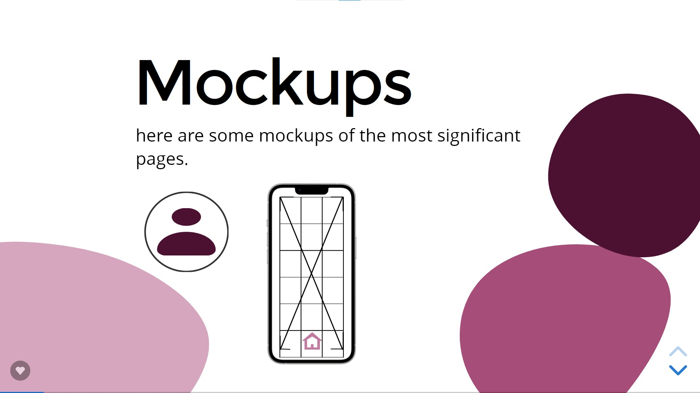
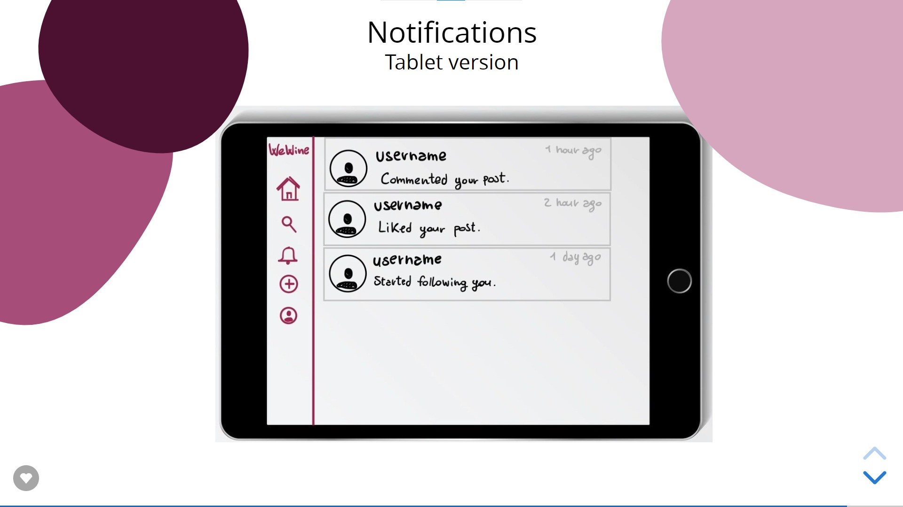

# WeWine

## Theme
We want to create a community of wine lovers, from the novice to the entrepreneur, where you can share your opinions about wine, with all the peculiarities of a social network.

## Mockup
You can view the mockups down here.  
For a better experience you can view the mockups by downloading the file **mockup.html** in the **mockup** folder, open it in your browser and use up and down arrows to move between the mockups.  
In alternative you can use this link (fullscreen recommended): https://slides.com/alessandrosciarrillo/palette

## How the design was done
- Initially we created some minimal mockups with the essential input interfaces 
- We recreated this mockups with some basic HTML and backend 
- We did an "experience prototyping" session with some external eterogeneous users (various age and computer knowledge) to evaluate the prototypes
- After collecting the results of the previous point we evoluted the initial mockups resolving all the reported problems
- We did a focus group with some target users (in our case, three sommeliers) to define accurately the domain and the terms to use
- In the end we started the develop

## Scope
- A user can follow and be followed by other users, add or remove likes and comments on other users' posts
- A user can edit his own **profile** after registrating, using the apposite button in the Profile section, which let him modify all the profile data including the password and the profile picture
- A user can specify its category (owner/grower/sommelier/passionate/novice) and, in the first two cases, a company address
- In a profile is possible to click on Followers and Followed fields to view the list of all the relative users
- A user can **post** a review regarding the tasting of a wine, being able to enter:   
  - name of the wine   
  - origin  
  - rating (0-5 stars)  
  - taste notes  
  - a photo  
  - 4 taste indicators with adjustable sliders (a balance indicator of their values will be shown under them)
    - light/structured
    - soft/tannic
    - dry/sweet
    - flat/sour    
  - It is also possible to scan or manually enter the wine barcode in order to make it easier for other users to search that specific wine on the web, using a dedicated button
- A post can be opened by clicking on the text, which let you see the list of users who liked the post by clicking on the number at the bottom right of every post
- It's possible to view and post comments by clicking the comment logo at the bottom right of every post
- In the bottom section of every post is present a button "Search wine" which redirect to a google search of that specific wine: if the barcode was entered, the search is based on it, in other case the wine name will be used
- For every post and notification it is shown the time passed from the event.
- When a user receives a **notification**: 
  - if the user is online at the time of receipt, a push notification is displayed

  - in any case the notifications logo starts to swing and by clicking on the notifications button it is possible to view both the new and old notifications, distinguished by color

## Peculiarities
- The password are not transmitted in clear and salted with an unique salt 
- The queries are executed by a special user with particular privileges on the DB
- We prevented SQL injections by using binding
- The feed is loaded dynamically for a better efficiency
- The user search is dynamic and not require to click a button to launch it
- Every action includes a check on the login status: if you are not logged anymore you will be redirect to the login page
- Push notifications are shown in overlay for every event happened in the last 3 seconds
- When new notifications are present the notification logo of the navigation bar starts to swing
- To insert a barcode of a wine we have set up a barcode scanner, which use the device camera or an uploaded image

## Instructions
- Copy the folder on a web server
- Run the file **db_init.sql** on a DBMS
- Connect to `localhost\wt-project\website` and create an account
- Login
- Start using the social!
